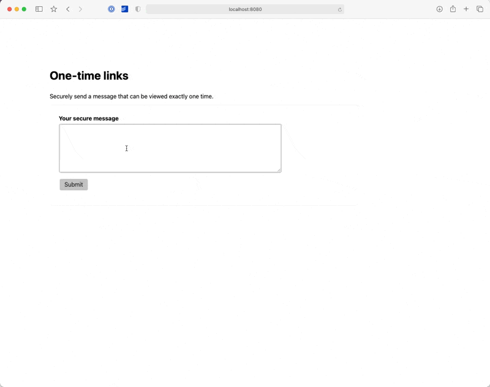

# One-time links

Securely share one-time links.



## Implementation

This is the tech I was excited to try out for this project!

- Uses go:embed to make templates available at runtime in the binary
- Encrypts / decrypts messages using https://github.com/ProtonMail/gopenpgp
- Stores messages in DynamoDB

## Work left

- Generate random password when a message is created
- Delete message after rendering
- Host this somewhere!
- Add favicon

## Build / run

To run locally for development install dependencies and then

```bash
go run server.go
```

To create a binary

```bash
go build server.go
```

### Environment variables

When you `go run server.go` or when you run the binary, you will need to have these environment variables defined:

- AWS_ACCESS_KEY_ID
- AWS_SECRET_ACCESS_KEY
